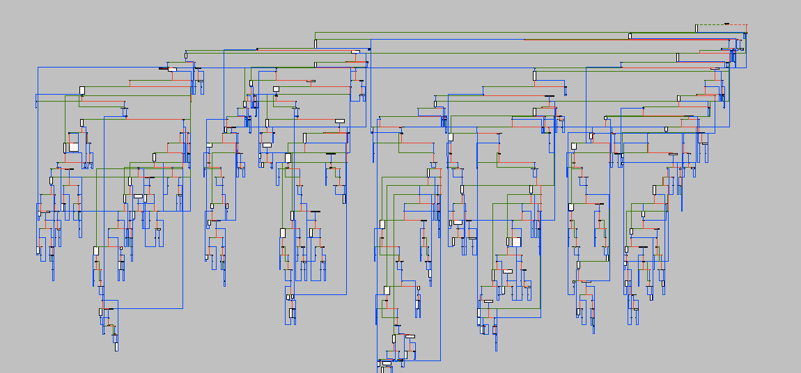

# CFF Engineer
Flow Flttener Generator That Can Be Used To Make Dynamic Analysis By Humans Much More Impossible. Much Easier To Use And More Versatile.

## Capabilities
The Program Can Generate Infinite Ammount of cff that dont share any similarities among each other, and it offers layer based cff which can in turn help against call indexing by malware analysts. The capabilities can be summerized as:

1. Dynamic Variable Generation.
2. Layer Based Class Functions.
3. Taken Loops And Useless Loops.
4. Shufflers.
5. Random Instruction Sets

## Example Flattener

